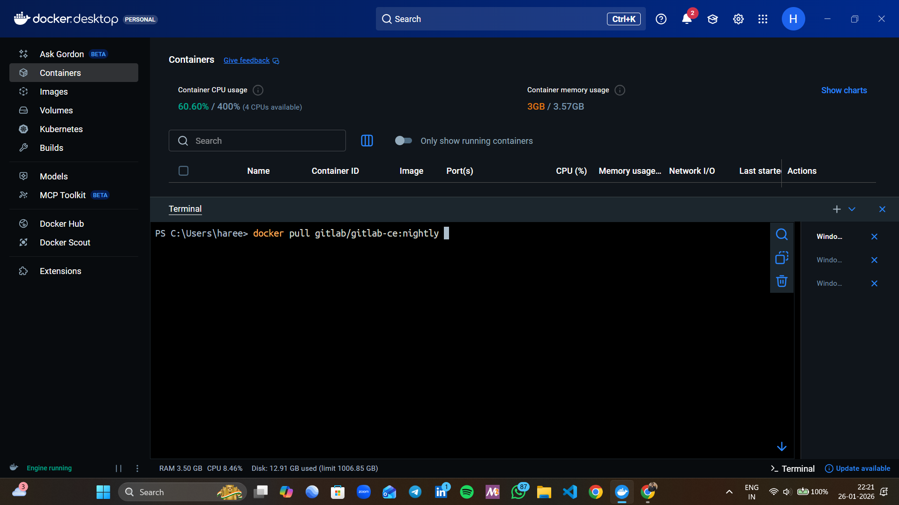

# 🚀 GitLab Setup & Run Using Docker

<p align="center">
  
  
  
</p>

---

## 📌 Project Overview
This project demonstrates how to **set up and run GitLab using Docker** on a local machine.  
The objective of this task is to understand Docker containerization, image pulling, container execution, and accessing GitLab locally.

GitLab **Community Edition (CE)** is pulled from Docker Hub and run using Docker Desktop.

---

## 🛠️ Tools & Technologies Used
- Docker Desktop  
- GitLab Community Edition (CE)  
- Docker Hub  
- Web Browser (Localhost)  

---

## 📦 Step 1: Pull GitLab Image from Docker Hub

### Command Used:
```bash
docker pull gitlab/gitlab-ce:nightly
```

⏱️ Time Taken: 5–10 minutes

---


## ▶️ Step 2: Run GitLab Container

### Command Used:
```bash
docker run -p 8000:80 gitlab/gitlab-ce
```

⏱️ Time Taken: 5–8 minutes

---

## 🌐 Step 3: Access GitLab on Browser

```
http://localhost:8000/
```

---

## 🔐 Step 4: Retrieve GitLab Root Password

```bash
docker exec -it bd6e0f1444aa cat /etc/gitlab/initial_root_password
```

---

## ✅ Step 5: Login to GitLab Dashboard

Username: root  
Password: Retrieved from previous step

---

## 🎯 Learning Outcomes
- Docker image pulling
- Container execution
- GitLab setup on Docker
- Credential retrieval

---

## 📌 Conclusion
Running GitLab on Docker is a fast and efficient way to learn DevOps fundamentals.

---

## 👤 Author
**Hareesh Rajput**  
[GitHub](https://github.com/Hareesh-Rajput ) 
[LinkedIn](https://www.linkedin.com/in/hareesh-rajput/)
